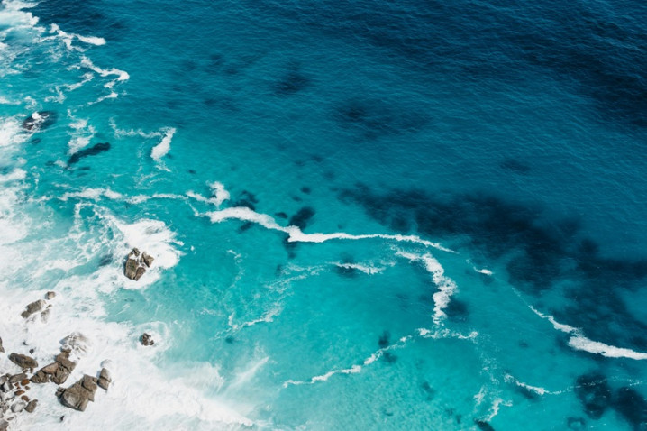
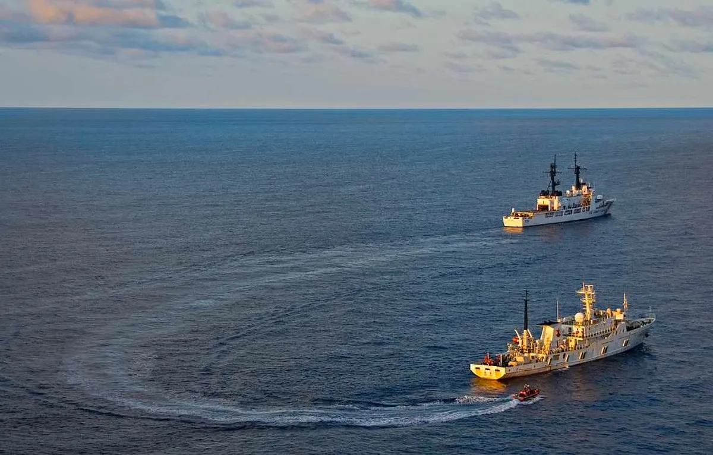
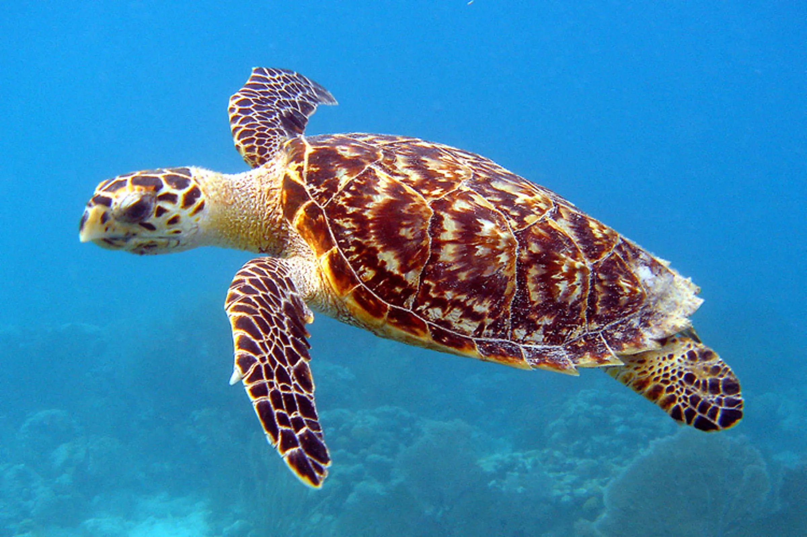

今年，海洋保育邁入重要里程碑，根據世界保護與保育區資料庫（WDPCA）的數據，全球海洋保護區面積已達10%。雖然這一目標比預期晚了六年，但近兩年新增的保護區面積超過歐盟的總和，顯示出迅速的進展。

今年海洋保育終於跨過了一道重要門檻，根據世界保護與保育區資料庫（WDPCA）的最新數據，全球目前已有10%的海洋正式納入保護區。雖然比原訂目標晚了六年，但這兩年增加的海洋保護區面積甚至比歐盟還大，進展神速。

不過專家提醒，若要在2030年前達成「30x30」保育目標，還需劃設約「整個印度洋大小」的保護區。要完成這塊保育拼圖，占了海洋六成以上面積的公海必不可少。所幸，1月17日正式生效的聯合國《公海條約》（BBNJ），不僅讓公海告別法外之地，更得以據此設立公海海洋保護區（MPAs）。

美國海岸防衛隊（USCG）在公海中執勤時扣押他國漁船。圖片來源：Picryl (Public Domain)

## 首批公海保護區 西非國家搶先卡位

誰將可能成為率先保護公海的先驅？根據《Mongabay》報導，目前全球正積極關注三個地方。
西非經濟共同體（ECOWAS），由奈及利亞、迦納等七個國家組成的協調委員會將鎖定「加那利涼流與幾內亞暖流的交匯區」提案，這塊被公認為具有重要生態或生物意義的海洋區域（EBSA），也是全球最重要的漁場之一。ECOWAS預計今年底交出草案，並將於公海條約締約方的首屆會議上審理。

這片海域從大西洋島國維德角與塞內加爾外海，一路延伸到奈及利亞與聖多美普林西比。當冰涼的加那利洋流與溫暖的幾內亞洋流交匯時，強烈湧升流會將深海營養鹽推向海面，滋養了龐大的浮游生物群，進而吸引小型魚類與大型掠食者。

「每年數百萬噸捕撈漁業來自這裡，保障了西非沿岸超過3億人的糧食安全與生計。」研究人員指出。

成群的沙丁魚、鯷魚、鯖魚、鮪魚等魚類在這片海域悠游，龍蝦、蝦子等甲殼類動物則增添了生態與經濟價值。此外，大型魚類、鯊魚會在此覓食、產卵，長途遷徙物種則會由此往返北大西洋與南大西洋間。這裡也是玳瑁、塞鯨（sei whale）等瀕危動物的重要棲息地。

公海占了海洋六成以上面積，但全球卻只有1.5%的區域受到保護。照片來源：U.S. Fish and Wildlife Service

## 遺世獨立的生物多樣性熱點

除了西非諸國，智利則將目標鎖定東南太平洋下的薩拉斯-戈麥斯（Salas y Gómez）與納斯卡（Nazca）海底山脈，從復活節島（Rapa Nui）向東延伸至智利與祕魯，由110座火山組成，全長3000公里。

相連、密集的海底山脊帶來豐富的生物多樣性，為鯨魚、海龜、劍旗魚、竹莢魚等具有重要生態意義的物種提供棲息地。

這片海域擁有全球比例最高的特有種。受惠於周圍的祕魯洋流、阿塔卡馬海溝與低氧區域形成的天然屏障，生活在智利與祕魯的海洋物種能遺世孤立、不受侵擾。據估計，此處約有一半的海洋物種是特有種。

印度洋島國塞席爾與模里西斯，則提案將薩亞德馬哈（Saya de Malha）淺灘設為公海海洋保護區。薩亞德馬哈淺灘位於馬達加斯加以北，擁有世界最大的海草床，約80~90%的海床被海草覆蓋。

因地處偏遠，這片淺灘得以完好保存至今，為著名的生物多樣性熱點。不僅有廣闊的珊瑚群落與殼狀紅珊瑚藻，目前已發現超過150種無脊椎動物與100種腹足綱動物，也成為抹香鯨與藍鯨的重要繁殖地。

根據《Mongabay》報導，正式設立公海海洋保護區之前，還必須選出一個有權評估提案和提出建議的科學和技術機構。「若缺乏執法能力，保護區就只會淪為『紙上保護區』。」旅遊媒體《Outlook Traveller》指出，這將會是首次實驗，測試這些缺乏主權的海域能否有效落實集體治理及執法。

## 參考資料
- Mongabay（2026年3月31日），[With high seas treaty in place, West African countries plan for protected area](https://news.mongabay.com/2026/03/with-high-seas-treaty-in-place-west-african-countries-plan-for-protected-area/)
- Outlook traveller（2026年4月5日），[West Africa’s Ocean Hotspot Could Become The World’s Next High Seas Sanctuary](https://www.outlooktraveller.com/News/west-africas-ocean-hotspot-could-become-the-worlds-next-high-seas-sanctuary)
- Pew（2024年5月1日），[A Path to Creating the First Generation of High Seas Protected Areas](https://www.pew.org/en/research-and-analysis/reports/2020/03/a-path-to-creating-the-first-generation-of-high-seas-protected-areas)
- Conservation Corridor, [High Seas – Chile Proposes Protections for Salas y Gómez and Nazca Ridges in Anticipation of Global Treaty](https://conservationcorridor.org/ccsg/working-groups/mcwg/mcwg-activities/case-studies/chile/)
- High Seas Alliance, [Saya de Malha](https://conservationcorridor.org/ccsg/working-groups/mcwg/mcwg-activities/case-studies/chile/)

## 新聞原文連結
[https://csrone.com/news/9886](https://csrone.com/news/9886)