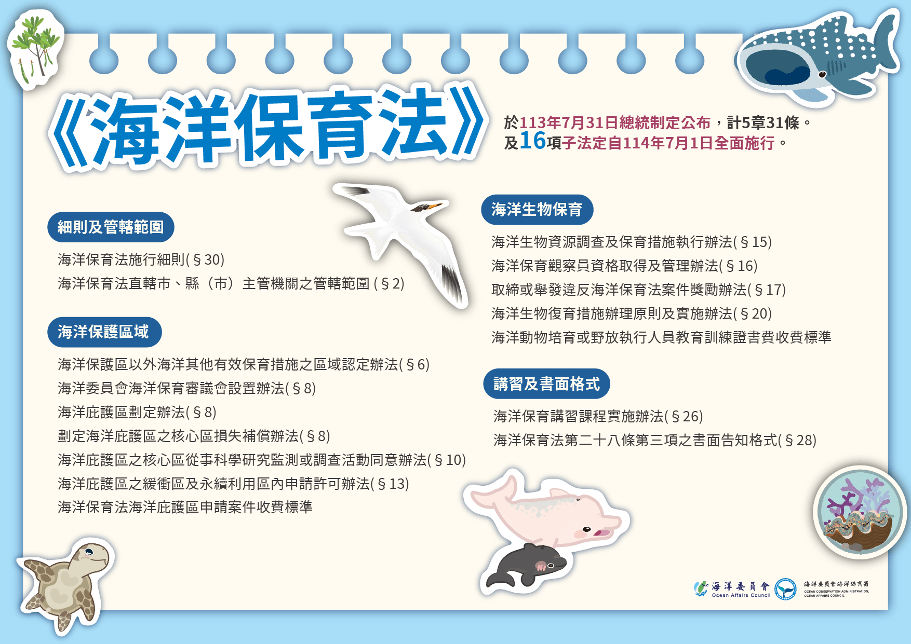
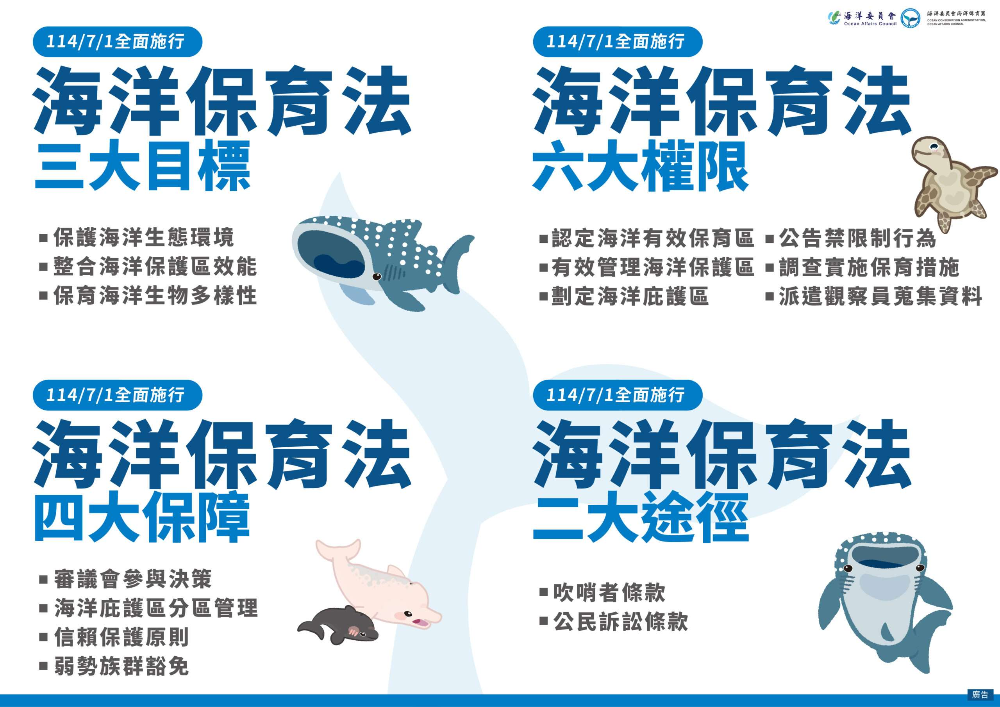

我國第一個以海洋生態保育為核心的綜合性法規《海洋保育法》於今(1)日全面施行。海洋委員會主任委員管碧玲強調，海洋保育法是海洋法制推動中，難度最高、牽涉範圍對象最廣、權利義務關係也最為複雜的一部法律，歷經多年溝通協商，在朝野黨團與全國各界人士高度共識以及國人的支持下，去(113)年7月31日經總統制定公布，感謝各級政府、各黨團、原住民、漁民、漁會、在地及保育團體、企業及國人等海洋保育重要合作夥伴持續支持與行動。配合該法今日全面施行，16項配套子法同時上路，並以「強化統合」、「資源挹注」以及「公私協力」三箭齊發，結合跨域、跨界力量為海洋發聲，全面守護藍色國土，象徵台灣邁入海洋保育的新紀元。

我國第一個以海洋生態保育為核心的綜合性法規《海洋保育法》7/1全面施行。圖：海保署提供

管碧玲表示，海洋保育法自108年預告以來，歷經數十場環團、產業界、漁民、漁會及原住民等社會溝通與行政協調，以及行政院跨部會協商會議及行政院會、立法院審議及三讀通過，終於在去年7月31日經總統制定公布，總條文數31條，另有16項配套子法配合該法於今日上路；透過此海洋保護法規，有助於政府與民間合力強化三大目標、四大保障、六大權限及二大公民監督途徑，積極面對氣候變遷、棲地破壞、生物多樣性下降等嚴峻威脅，合力提升台灣海域保護區域質與量、保育與復育海洋生物多樣性，對海洋保護做出更積極的貢獻。

《海洋保育法》全面守護藍色國土，象徵台灣邁入海洋保育的新紀元。圖：海保署提供

管碧玲強調，海洋生態環境面臨多重、複雜及艱難的挑戰，期盼透過「強化統合」、「資源挹注」以及「公私協力」三箭齊發的綜效，帶動跨部會、跨領域的資源投入海洋保育，守護湛藍的國土。

管碧玲進一步說明，首先是「強化統合」，過去海委會海保署於111年度首度試辦全台45處海洋保護區評估管理成效，逾4成屬中度及低度保護，人力經費短缺，管理效能較差，透過112至113年深入輔導七美及頭城漁業資源保育區，成功調整管理措施並提升管理成效。海委會將以此評鑑為基礎，於海洋保育法全面施行後一年內，發揮統合效能，邀集護海機關共同擬訂整體海洋保護區管理政策方針，提升海洋保護區之管理績效與品質；同時推動用海單位、國營事業優先引領投入海洋有效保育區(OECMs)的認定。

其次是「資源挹注」，管碧玲說，為因應海洋保育法施行後各種重大工作的開展，行政院已於113年核定台灣海域生態守護計畫，自114年起，分6年投入總經費24億的預算，由海委會結合農業部漁業署、水產試驗所共同推動執行6大策略、16個子項目。

管碧玲提到，最後是「公私協力」，海保署在地守護的力量，從108年的4個團體至114年的102個團體參與；而現行71個海洋保護區有44個保護區成立巡守隊，未來希望所有保護區都能有人全面守護。另外，海委會也與金管會合作，在今年3月將海洋保育行動方案納入「第12屆公司治理評鑑指標參考範例」，期盼持續藉由跨部會、跨領域，結合政府、國公營事業、企業及民間團體力量，擴大在地守護及海洋保育ESG媒合量能，通力合作提升台灣整體海洋保護區域的質與量。

管碧玲進一步補充，海洋孕育生命，地球超過50%的氧氣來自海洋，而台灣擁有超過1.5萬種海洋生物，展現豐富的生物多樣性，並提供糧食、調節氣候等關鍵生態系統服務價值。維護海洋生態環境與資源永續，不僅攸關生態平衡，更關乎我國長遠發展與國際責任。她期盼，長期「海洋無聲的悲鳴」，隨著海洋保育法的全面施行，作為「海洋最有聲的力量」，讓海洋保護區全面充實在地守護，也透過政府持續資源挹注、擴大ESG媒合，以及推動用海單位、國營事業優先引領投入海洋OECMs，並以科學為基礎，維持生物多樣性，劃定海洋庇護區，鼓勵全民共同打造迎向韌性、以自然為本及公平包容的海洋，確保世世代代都能擁有豐饒而永續的藍色海洋，實現自然與人類和諧共生的願景。

海保署說明，《海洋保育法》及16項配套子法於7月1日全面施行，相關機關、單位、團體及民眾欲知進一步資訊，可至海保署官網，或至海委會主管查詢系統、全國法規資料庫查詢閱覽。

## 新聞原文連結
[桃園電子報 新聞網](https://tyenews.com/2025/07/883283/)