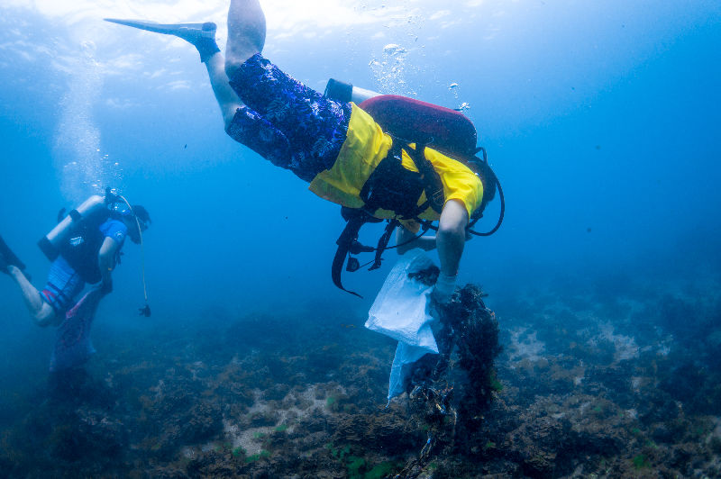
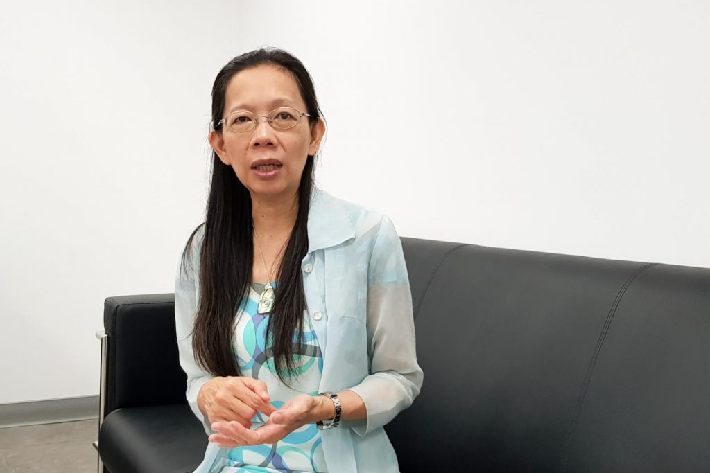
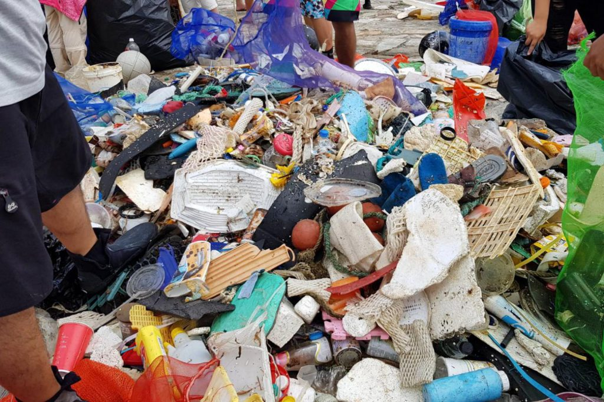
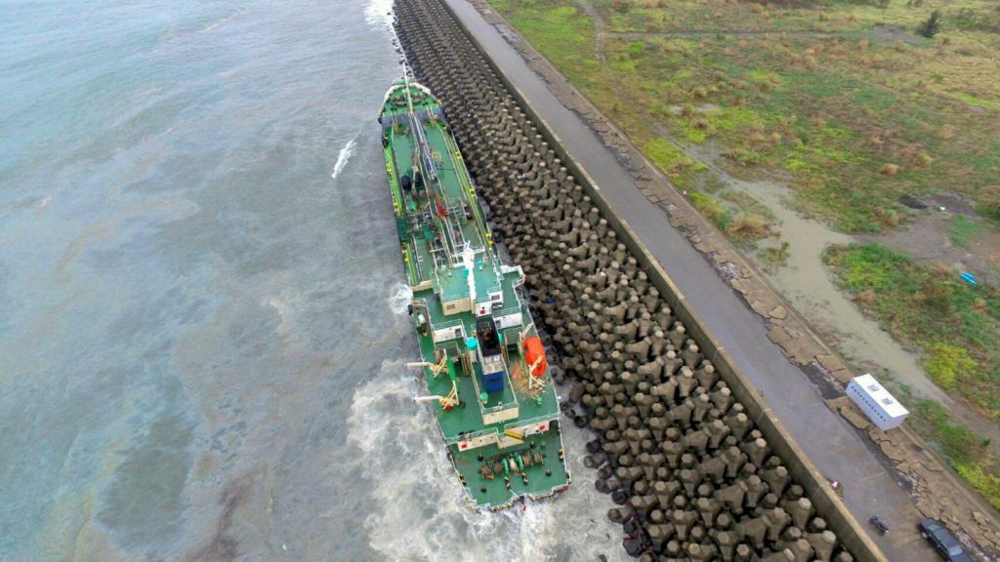
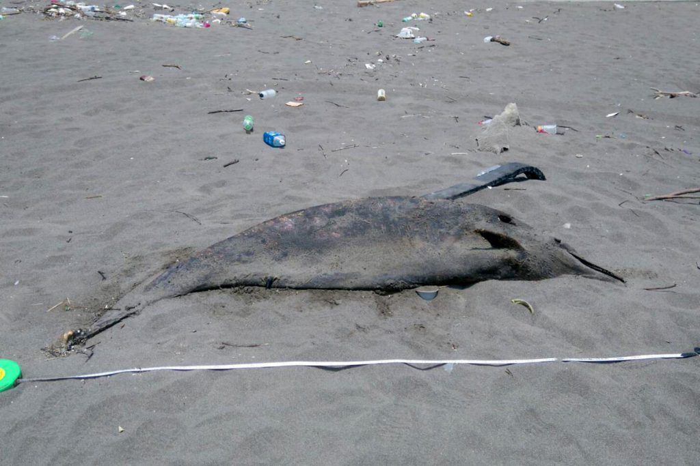
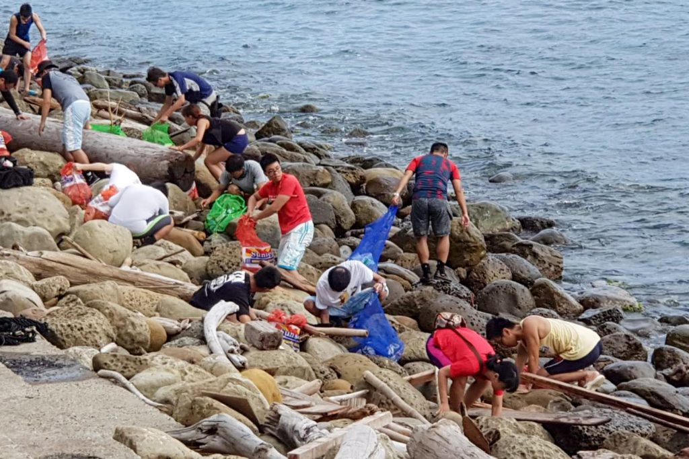

**文／ 洪嘉鎂　圖片提供／ 海洋委員會海洋保育署**

過去國內海洋保育相關事務管理分散在環境保護署、農業委員會、內政部等多個部會，今（107）年4月28日海洋保育署（下稱海保署）正式成立，隸屬海洋委員會，首任海保署署長由國立臺灣海洋大學海洋事務與資源管理研究所教授黃向文擔任，過去黃向文曾任臺北縣政府農業局漁業課課員、農委會漁業署遠洋漁業組科長，後來進入學術界投入海洋研究，長期關注海洋廢棄物、漁業混獲海龜、海鳥等議題，也曾參與多個漁業國際委員會，為臺灣科學家代表，對於國際海洋保育事務相當熟悉。

黃向文接受《農傳媒》專訪時指出，立法院通過《海洋委員會海洋保育署組織法》時，自己還在學校擔任教職，過程中都是從旁觀者角度去期待海保署能為國家海洋的保育做些什麼，在很晚的階段才確定會到這裡地方，因此開始思考海保署未來規劃及了解業務交接工作，為海保署訂下三個具體目標：乾淨海水、健康棲地、永續資源。

國內民眾近年相當關注塑膠微粒、海洋廢棄物等相關問題，黃向文表示，未來將評估微塑膠、海洋廢棄物納入水質監測項目，也會製作海洋廢棄物地圖，針對不同區域提出解決辦法。為保育海洋生物及棲地，她也希望在未來制定海洋生物保育專法，目前海洋委員會正在草擬《海洋基本法》，希望能在下個會期送入立法院，當中就涵蓋海洋保護區、海洋保育等相關規章。

黃向文期望，海保署可以達成乾淨海水、健康棲地、永續資源，三大目標。（攝影／洪嘉鎂）

**農傳媒特別專訪海保署首任署長黃向文，談論她對於海洋保育署未來規劃，該如何面對臺灣海域的廢棄物、汙染、海洋生物保育等相關問題。以下以第一人稱方式呈現：**

## 三大目標，還給生物一片乾淨的海洋

《海洋委員會海洋保育署組織法》在2015年7月1日通過，迄海保署掛牌將近3年時間，就組織法來看，海保署感覺有很多很宏偉目標值得去發揮，就我來看，有三項目標是最重要的，我們希望海水是乾淨的（Clean water）、希望有比較健康的棲地（Healthy habitat）跟永續資源（Sustainable resources），從水質環境，到多樣性棲地，以及能夠蘊藏永續的資源，我覺得這是三件海洋保育署應該要達到的目標。

行政院去年九月開始討論海保署業務交接時，幕僚單位覺得按照《海洋委員會海洋保育署組織法》，應移入17項業務，經各部會開會討論後，最後只移撥6項，其餘11項是其他部會認為不需要移撥。

廣義上，相關事件都是海保署依據組織法需要達成的任務，因此海保署在成立初期要重新檢視項目，如果想達成三個整體性目標時，需要透過各機關的協調、討論、合作，才能逐步達成。

舉例來說，漁業混獲問題需要與漁業署協調合作，較常看到鯨豚被刺網混獲、海龜被拖網混獲，但漁業署尚未在這兩類漁船派遣觀察員，會建議他們在刺網漁船及拖網漁船上派遣觀察員，了解有多少海龜、鯨豚混獲是來自於漁業，以及主要的區域，評估漁業對這些保育類物種的衝擊，以及研究避免混獲的措施。

## 製作海洋廢棄物地圖，研商解決漁業廢棄物

我覺得海洋廢棄物（下稱海廢）是個重要議題，也因此喚起很多人對海洋的關心，海廢議題蠻複雜，最近兩年環保署跟環保團體合作成立海廢治理平台，討論出海廢治理方案，包括如何強化減塑等。

海保署除了持續支援縣市政府清理海廢外，也將製作海廢地圖，了解各地海廢組成情況，針對不同區域提出最適宜的解決方式。

另外一塊是漁業廢棄物，如漁網、籠具在作業過程遺落到海裡，沒能被回收，大家也在絞盡腦汁處理，又或者養殖用的保麗龍怎麼樣鼓勵或是要求漁民回收。

除了政府在後端收購廢棄漁具外，是否該賦予前端漁具製造商責任，要求製造商負起回收成本與處理費用，我個人認為應該要加強廠商社會責任，才能夠提高回收意願，這部分也可以提供海廢治理平台共同研商。

《海洋污染防治法》移撥過來後，會繼續支援縣市政府相關應變計畫，包括油污染防治設備維護、在各地利用潛水人員等方式清理海廢，以及維持環保艦隊。不停派潛水工清海廢是非常耗費人力的事，我之前在學校曾做過海廢相關調查與研究，目前還持續進行。我們希望這一兩年能將資料拿出來檢視，結合公民科學家的海廢調查、海廢分布地點及組成，畫出一張海廢地圖，知道什麼地方海廢比較多，再配合《海洋污染防治法》思考能不能採行更多的措施。

## 未來海水水質檢測將新增微塑膠及海洋廢棄物

環保署在全臺設有105個水質監測點，《海洋污染防治法》亦要求從事油輸送者以及利用海洋設施從事探採、排放廢污水者、海洋棄置者須有海洋污染防治計畫以及進行相關海域的水質監控，且提交報告。今年度的檢測點都已經確認，海保署之後會檢討是否需要增加檢測點，也會設置一般民眾的通報機制，乃至機動性去檢測水質。

目前海水水質檢測沒有檢測海廢或是微塑膠，只有檢測酸鹼值、重金屬還有部分有機物，我們之後會考量將微塑膠與海廢列在檢測項目，這部分環保署環境檢驗所正在內部測試，倘未來公告微塑膠檢測方法，會再與相關單位討論設置標準。

《海洋污染防治法》管理範圍也包含重大油污事件的應變，如油輪、船舶的擱淺造成的污染，但現行法規對海洋污染的罰則不夠重，未來將修法提高額度，也會利用《海洋污染防治法》成立「海污基金」，協助海洋的管控與監測，萬一發生油污事件時也能緊急應變。

未來海保署將成立海汙基金，協助應對油輪擱淺後，可能造成的汙染事件。

## 不僅要管海洋汙染，更要在乎棲地保育

多年來國內有很多重大油污染事件，政府部門已經慢慢磨合出一套應變機制，我覺得未來可以思考加強從保育、環境面去改善，萬一真的發生後，後續的復原機制，現在看到的海污應變機制著重在前端處理油污，想盡辦法把油汙盡量清理完，但我們希望可以考量環境怎麼復原的問題。

像2010年美國墨西哥灣漏油事件，對環境影響非常大，他們利用石油公司賠償的經費成立基金會，大家共同討論如何做更積極清理改善與環境復原，比如說針對魚類、牡蠣、海龜的復育計畫等，他們也會定期進行水下探測，去看墨西哥灣海洋環境，發現深處仍有油污，因此會去監控當地生物相是否與之前不同，這是過往台灣緊急應變比較沒有注重的。

## 透過公民科學家力量，建立海洋野生動物棲地

近年潛水的人越來越多，他們第一線能幫忙反映海洋的狀況，我們希望可以整合民間力量，今年度海保署會投入資源建置整合性海洋生物平台，如果民間團體願意，可以把資料嫁接過來。

也希望透過公民科學家的方式，鼓勵各地潛水民眾或教練回報重要海洋生物物種，如豆丁海馬或是蘇眉、隆頭鸚哥魚、珊瑚礁魚類等，這些資訊如果累積到一定量，可以幫助我們決定哪些地方優先進行研究、需要設置類似海洋保護區的熱點，增加保護力道，讓地方資源更好一些。

國內有很多各式各樣海洋保護區性質的區域，各部會因為不同職掌、理由設計區域，目標與管理措施也不太一樣，我個人覺得對海保署來說，可先從大的海洋保護角度來看，先彙整各個單位相關研究結果，持續幫忙監控環境，交換資訊，未來希望結合國家海洋研究院力量，去建置比較完整的資源調查與監控體系。

除了協助處理海洋生物擱淺事件外，今年度海保署將投入資源建置整合性海洋生物平台，串聯民間團體的海洋資料，並結合公民科學家，找出臺灣哪些區域應設置類似海洋保護區的熱點，提高保護力道。

## 期望制定海洋生物保育專法，全面保障海洋生物

許多研究單位都有海洋環境相關資料，像國家公園等單位有生物多樣性資料，會花時間去看這些資料足不足以作為海洋保育管理決策的參考，當我們覺得不夠的時候，要去看哪些部份需要先補強。目前比較欠缺針對重要海洋生態系的調查，包括珊瑚礁，在海保署經費跟人力不充裕情況下，會寄望國家海洋研究院成立後能有海洋生態跟環境的研究，加上足夠經費就能建立完整資料。

1989年通過《野生動物保育法》後，早期較琢磨在陸地野生動物，保育名單上的海洋野生物種僅有鯨豚、海龜、隆頭鸚哥魚、曲紋唇魚（蘇眉魚），海保署可能考慮未來在《野生動物保育法》內劃出專章，或專門條文針對海洋動物，長程來看，我們希望可以涵蓋到植物和動物，針對海洋動植物的特性制定海洋生物的保育法。

## 安全推動海洋教育，讓民眾認識海洋

海保署未來推動海洋教育會比較著重在保育，一般來說，保育會希望保育海洋生態系，但很多時候能感動一般民眾的是明星物種，像是鯨豚、鯊魚，這會是一個比較好的保育宣導教育的媒介。

整體來說，要能找到合適的地區去推廣保育價值，比如說小琉球，去小琉球的人非常多，大家去看海龜，就會有人搞不清楚狀況去摸海龜，這是很好的教育機會，包括小琉球民眾很積極地的推動無塑、減塑，都是海洋環境教育的作法。

海洋教育不僅只有淨攤活動，黃向文希望應該要讓民眾更親近海洋，了解海洋生態系的多樣性，因此未來會嘗試和有關單位合作，打造海洋教育場域。

話說回來，怎樣可以鼓勵學校或家長帶著小朋友到海邊認識生物很重要，如果只是在書本上看到，沒有機會出去，很難感受到整個海洋生態系的多樣性，怎麼去營造讓一般民眾可以看到海洋生物的場域，同時要知道不可以想著把生物帶回家。未來可能在全台挑些觀光點，包括跟環保署、交通部觀光局合作，都是我們會嘗試著手的地方。

目前海洋委員會正在草擬《海洋基本法》，有哪些海洋議題需要注意，都會更廣泛去討論，不光是海洋保育、海洋保護區還有很多文化、產業、管理等面向，特別是怎麼利用、保護海洋，外加海域安全都涵蓋在內，希望能盡快在下一個會期送進立法院。

## 新聞原文連結
[農傳媒](https://www.agriharvest.tw/archives/17979/)
