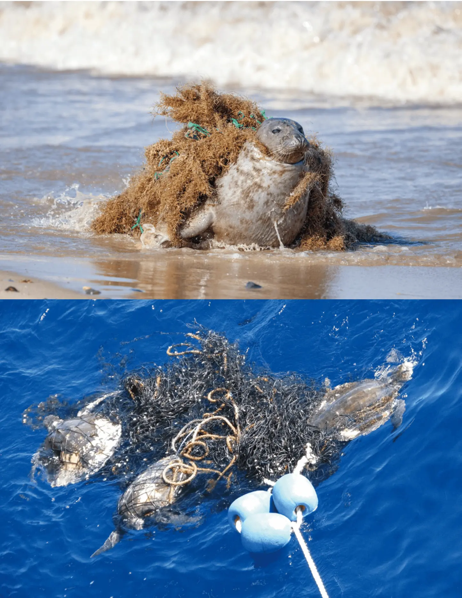
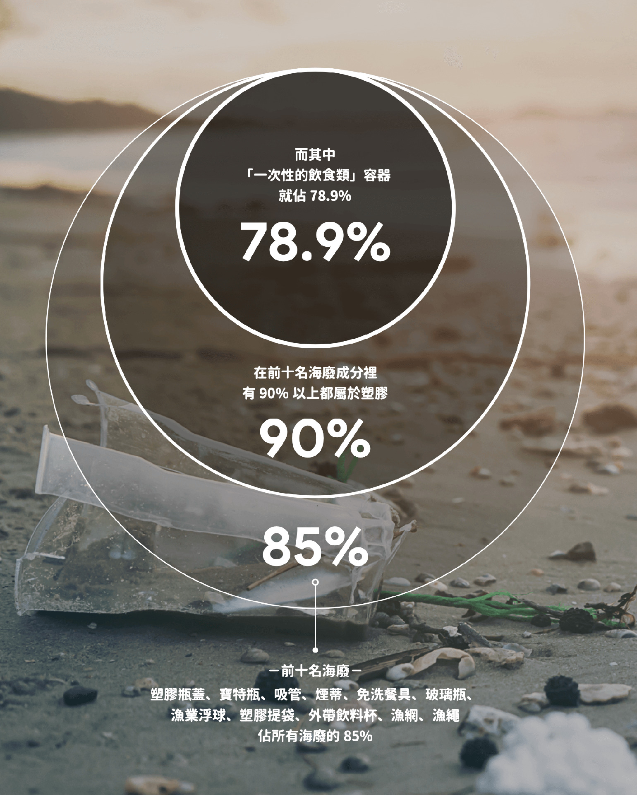
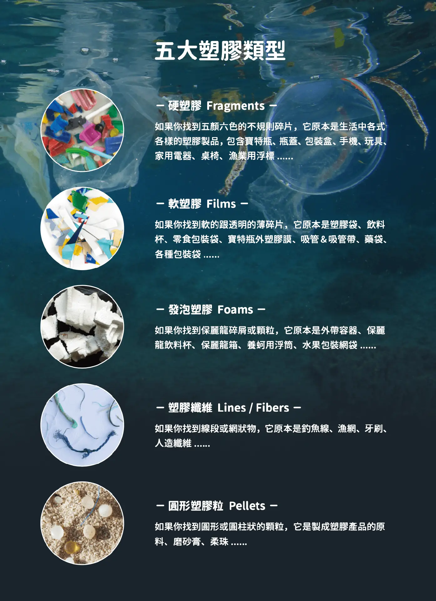

  
今年，海洋保育邁入重要里程碑，根據世界保護與保育區資料庫（WDPCA）的數據，全球海洋保護區面積已達10%。雖然這一目標比預期晚了六年，但近兩年新增的保護區面積超過歐盟的總和，顯示出迅速的進展。

## 找回與海洋的連結

地球是太陽系中少數有液態水存在的星球，表面約70％為海洋覆蓋，所以能孕育滋養生命；不過不是所有陸地都適合人類生存，能居住的區域僅佔整個地球不到30％，但人類種種生活行為卻大大影響著整個地球。

黑潮海洋文教基金會（以下簡稱黑潮）董事張卉君比喻，人體其實就和地球一樣，約70%是水分，所以「每個人心裡、身上都住著一座海洋，海洋，跟我們非常接近」。然而，有人會說，看到海第一時間會想到海鮮，生活在四面環海的島嶼，也許吃海鮮不是件困難或奢侈的事，但除了知道台灣海種類繁多外，我們是否也了解到，海洋廢棄物（以下簡稱海廢）在台灣四周海域其實也非常密佈？

**黑潮海洋文教基金會董事張卉君。（圖片來源：灃食公益飲食文化教育基金會提供）**

海廢，是近年受到關心的環境議題之一，「到底我們吃進去的是什麼樣的東西？在吃的過程中，我們有沒有可能也食入了我們不希望在海鮮裡吃到的東西？」張卉君提到，2018年環保署調查自來水、海水、沙灘、貝類，發現養殖魚類如淡菜、牡蠣、扇貝、蛤蠣等都含有塑膠微粒，而這些塑膠微粒，會以發泡塑膠、薄膜、顆粒、碎片、纖維等不同樣態出現，所以日常飲食料理常用到的鹽、甚至日常飲用水可能都會產生塑膠微粒。
漁業中的海洋廢棄物

長年關注海洋、鯨豚、漁業與海洋廢棄物議題，黑潮與澄洋環境顧問共同規畫調查海洋廢棄物的來源與成因。繼2020、2021年推出東海岸和西海岸漁業廢棄物圖鑑，他們發現，除了民生廢棄物之外，海廢有高達七成來自於養殖、捕撈等廢棄漁具。他們在研究裡訪問了三十幾位漁民，試圖了解這些廢棄漁具掉到海裡的原因，也定義出廢棄漁具指的是「遭遺棄、遺失或其他原因被丟棄的漁具」，可能是蓄意丟棄，可能是不慎遺失，也可能因為外在環境和經濟因素，考量之後遺棄。

然而，廢棄漁具的負面影響有哪些？第一是「纏繞」，廢棄漁具多以人造材料製造，海洋生物容易受到纏繞導致行為上無法自由而受傷，甚至導致死亡；第二是「航行危險」，廢棄漁網、纜繩可能會纏住螺旋槳或船舵、堵塞進水口，以及在漂浮時碰撞船艦，造成航行危險；第三則是「攝入」，海裡丟失的廢棄漁具、漁線、漁網等，容易附生藻類，使得海洋生物誤食；第四是「吸附」，有些漁具分解成塑膠微粒時，可能會吸引與吸收環境中有毒的污染物質，此外塑膠有容易吸附味道的特性，因此海洋生物不僅會因為看到有點像牠的食物而誤食，就連聞到味道也會覺得可能是食物；第五是「滲出」，有些漁具為了防腐，會在下水前浸泡化學藥劑，有的也會添加重金屬塗料，這些化學物質都會慢慢釋放到海洋環境中。

張卉君提到，這些廢棄漁具不僅會漂浮在海水表面，也有非常多依然存在於海洋底下持續地成為捕撈現象，但這些被困住的漁獲人類吃不到，當然也無法換算成更高的生產力，例如台灣常見的家計型沿近岸捕撈漁網「刺網」，容易造成生態的混獲跟纏繞，如果這些漁網遭到廢棄掉入海裡，因為看不清楚，海洋生物還是會持續地中網，所以被稱為「鬼網」；不同的船隻及漁法也會對海洋生物造成影響，像是比較遠洋會使用的「拖網」「延繩釣」等，雖然漁民並非有意要撈捕海龜，但許多海洋生物卻會一併被打撈上岸；另外，有時若太多廢棄物覆蓋在珊瑚礁周邊，等浪來或大潮時，可能會對珊瑚礁產生帶動和拉扯而造成傷害。

她強調，海洋生物受到海廢影響，不僅是海龜鼻子插吸管這件事而已。許多受到漁具影響的海洋生物，包含大型、水底下的，甚至是浮游生物，他們都會吃進塑膠微粒，「像是鯨鯊這類比較大的濾食性動物，大家可以想像牠在海域生活的情況下，有沒有辦法過濾掉這些塑膠微粒？這就好比要你從一杯珍珠奶茶裡挑出一顆白色珍珠一樣艱難......」對海洋生物來說，吃進垃圾這件事幾乎難以避免。她提到，過去在花蓮海域有非常多擱淺生物的調查，可以看見很多鯨豚身上會有漁網纏繞的痕跡；有時漁民無意打撈鯨豚，可一旦漁網被卡住時，為了拿回網子，有時會直接砍掉鯨豚尾巴，這些都讓我們知道海洋生物其實正受到漁業廢棄物的影響。

海洋生物受到海廢影響，不僅是海龜鼻子插吸管這件事而已。許多受到漁具影響的海洋生物，包含大型、水底下的，甚至是浮游生物，他們都會吃進塑膠微粒。（圖片來源：灃食公益飲食文化教育基金會提供）

## 海廢監測計畫 從淨灘中發現問題

海廢屬於髒亂問題，還是污染問題？張卉君說，海廢無法經由移除整理乾淨就能解決，因此大家都有共識，海洋廢棄物屬於「污染」問題，而非僅是髒亂問題。若是「污染」層次，就需針對污染指標制定目標，「每天出門，我們可以透過指標觀察空氣污染嚴不嚴重，可是，哪裡可以看到海洋污染的指標？所以這就是觀測海廢議題重要的原因，也希望可以有帶領大家進一步認識海洋生物的機會，並了解這些動物的棲地與現況。」

近年來盛行淨灘活動，淨灘的目標若是「撿乾淨」，可是垃圾很快又會出現，因此讓人有徒勞無功之感。張卉君說，黑潮2000年啟動了海廢監測計畫，並將國際淨灘行動（International Coastal Cleanup，簡稱ICC）以及監測海廢來源的方式引入台灣。這個淨灘的方式，除了「撿」之外，最重要是「紀錄」我們到底撿了什麼，「淨灘不是解決海廢問題的方法，但卻是發現問題的途徑。想要發現問題，就需要透過科技紀錄、統計與調查累積數據，這些數據在經過統計後，成為教育大眾了解海洋污染的嚴重性，這些資料，也可用來督促公部門訂定相關法令。」

2021年的淨灘行動統計發現的廢棄物，前十名海廢（包含塑膠瓶蓋、寶特瓶、吸管、煙蒂、免洗餐具、玻璃瓶、漁業浮球、塑膠提袋、外帶飲料杯、漁網及漁繩）就佔了所有海廢的85%。換句話說，如果重點管理這十樣東西，就能有效減少85%的海廢。她說，分析前十名海廢成分後發現，有90%以上都屬於塑膠，進一步做海洋廢棄物組成分析，「一次性的飲食類」就佔78.9%，「這就是為什麼現在有很多的限塑政策，是針對在瓶子、塑膠袋這些一次性包裝的原因，這也就是經過紀錄調查分析後，進而影響政策的結果。」

她說，如果我們能夠改善、減少一次性飲食類的垃圾，就能減少海廢來源。海廢是「全球尺度」甚至「跨世代」的影響，也是這幾年海廢議題被特別關注的原因，「黑潮從2000年就開始做海廢議題，20多年後我們大家還是在關注一樣的題目，這表示海廢是一個非常需要長期投入，而且非常需要更多的人一起來努力的議題......」她鼓勵大家有機會可以嘗試淨灘活動，如果你體驗過撿垃圾有多難，就不會那麼輕易去丟垃圾。

**海廢是「全球尺度」甚至「跨世代」的影響，也是這幾年海廢議題被特別關注的原因。（圖片來源：灃食公益飲食文化教育基金會提供）**

## 黑潮島航計畫 生態指標的體檢紀錄

為了解海洋塑膠微粒、廢棄物在台灣周圍海域影響的嚴重程度，2018年黑潮啟動「島航計畫 Beyond the blue」，開著船從花蓮港出發繞行台灣一圈，透過51個檢測點進行生態指標的體檢紀錄，以「海洋廢棄物及塑膠微粒」、「水下噪音」、「海水溶氧量快篩」三項檢測重點做為計畫的生態調查指標。

這個研究計畫從2018年一直持續到2020年，針對重點海域進行長期調查，她說，航行時在船隻附近的潮界線上，會看到密密麻麻的海廢，這些東西都非常細碎，要如何清除呢？若全部撈起來清除「微塑膠」時，也同時會撈到海洋金字塔底層很重要的浮游生物，因此要用這種清除方法是辦不到的。無法清除的塑膠微粒，散佈在海洋中，而隨著沉降作用在海床底下的人為垃圾更是無法計數，更有研究指出，有94%的垃圾是沉在海底下。

黑潮島航計畫收集塑膠微粒的採樣器材及方法，是參考美國五大環流基金會 （5 Gyres） 設計的水面拖網（Manta Trawl），撈取海水表面樣本保存至瓶內，在計算出各測點塑膠個數後，分析出塑膠微粒的分佈情況及塑膠類型。所謂的塑膠微粒或微型塑膠（Microplastics）在國際學術界的定義為直徑小於五釐米的塑膠碎片，如果將塑膠分成五大類型來統計，可分成硬塑膠、軟塑膠、發泡塑膠、塑膠纖維、圓形塑膠粒。

根據2018年「島航計畫」塑膠微粒成果分析，發現全台51個檢測點的塑膠微粒發現率是100%，以西部海域平均數量最多、五大類塑膠佔比以「硬塑膠」比例最高，「本來我們還在想這個塑膠的影響到底是不是很嚴重？到底有多嚴重？撈完之後，我們就覺得非常嚴重！」 張卉君說。

**如果將塑膠分成五大類型來統計，可分成硬塑膠、軟塑膠、發泡塑膠、塑膠纖維、圓形塑膠粒。（圖片來源：灃食公益飲食文化教育基金會提供）**

## 海洋廢棄物與飲食的關聯

國外研究指出，海水養殖活動為海上漂浮垃圾的顯著來源，而漁業則產生約18%的海洋垃圾。台灣所在的東亞區域，為全球最大的海水養殖產區，除了台灣西部海域之外，中國、日本與韓國皆為牡蠣生產大國。但是，養殖所產生的廢棄物，如保麗龍浮具產生大量的微塑膠碎屑不易清除，不但在當地造成嚴重污染，也隨海流四處漂流，成為台灣海岸常見的海漂垃圾。

在航行台南海域時，可以看到非常多浮筏式蚵棚。她說，牡蠣的養殖，目前最常見的是浮筏式的養殖法，通常上面以竹子搭成蚵棚，下面則使用塑膠繩索當作養蚵的蚵繩，把蚵仔串起來。為了要讓浮棚浮起來，就會需要浮力良好的保麗龍，每個棚子約需16塊的塑膠保麗龍，所以一個棚架的組成包含蚵棚、浮具、蚵繩等，光台南海域就有900多組棚架，而台灣養殖牡蠣雲嘉南沿海都有，所以可以想像，光是一個產業所衍生出的廢棄物種類非常多。

海廢需要多少時間分解？根據美國國家海洋暨大氣總署（NOAA）統計，說明常見的海洋垃圾估計的分解率：一個塑膠瓶估計450年才能分解、一個被丟棄或飛走的塑膠袋可以在我們身邊保存長達20年、使用了兩年的魚線需要分解600年、浮球可能要50年，如果從方便性跟環境成本的概念來看，使用這些東西的時間，跟它在環境中需要分解的時間比起來，我們，真的要使用它嗎？
海洋垃圾的來源與解方

當然，海廢的來源多元，有陸域也有海域。科學家研究，每年有很多塑膠物流入海洋，有80%來源是陸域，20%則從海域或船上。在這個跨域的海廢議題中，聯合國提出三個主要策略來解決海廢問題，第一，監測、清理已在海洋中的塑膠廢棄物；第二，管理使用後的塑膠製品，避免進入海洋；第三，改變生產與消費模式，避免塑膠廢棄物形成。

張卉君分享，全球有很多發明家在思索如何回收海上廢棄物：來自荷蘭的Boyan Slat 16歲時到希臘旅行，在潛水時發現塑膠垃圾的數量，居然比魚還多，於是萌生發明「海洋吸塵器」的念頭；澳洲的兩位衝浪工程師，2015年提出「海上垃圾桶（Seabin）概念，是一個由大型纖維網製成的垃圾桶，架設於碼頭附近且飄在海面上，可以吸納滲出的浮油，以及比較小的廢棄物；2020年，臺灣大學海洋研究所研究團隊發明港口吸塵器「湛鬥機」。「我們會發現這幾個重要的發明，其實都是在做末端的清除工作，這個工作非常重要，可是，如何在源頭去做改善，還是會回到我們每個人的責任，所以最後不能免除的還是必須提起，我們如何在自己的生活裡實踐......」她說。

## 從消費選擇 決定你要的未來

「改變行為大於改變材質，大家不要覺得塑膠是萬惡的存在，就把家中的塑膠袋全部丟掉，改去買很多環保袋，這是一個非常矛盾的做法......重點是，我們希望可以改變一次性消耗的行為，如果有塑膠袋，就儘量把它用到不能用，大家可以挑戰看看，一個塑膠袋最多可以用幾次！」張卉君說。

她也特別提醒，如果本身很能實踐、對環境很有概念的人，想要影響身邊人時，建議用「提醒」大於「譴責」，如果別人使用免洗筷，不要馬上對他說：「你這樣不環保！」，而是如果有辦法多帶一副筷子提供對方，這讓改變過程比較舒服，也能在生活裡慢慢去進行，就像旅行時，建議可以自備盥洗用品、選擇環保旅館。

回到最初提到的地球組成，人類生活範圍其實只佔了30%不到的地球面積，而70%的海洋居民卻受人類生活選擇影響甚鉅，所以，如何透過改變行為，還給70%的海洋居民一個乾淨的生活空間？最重要的是，透過消費裡選擇想要的未來。也許不是每個人都在第一線做清理海洋廢棄物工作，可是在這個時代，每個人都能為自己的消費負責任時，知道產品製成是怎麼來，藉由每個選擇保持一份覺察，就有機會做到最想要的未來。

「我們過去跟海洋關係的斷裂，不了解它，現在可以透過生活裡面的各種選擇和覺察，重新去面向海，連結人跟環境的關係，讓你心裡的那座海洋，也可以跟外在的這個海洋，連結起來。」

<iframe width="943" height="539" src="https://www.youtube.com/embed/kItY5DaBdbo" title="【海洋的神秘面紗】 關於海，你不知道的『塑』？" frameborder="0" allow="accelerometer; autoplay; clipboard-write; encrypted-media; gyroscope; picture-in-picture; web-share" referrerpolicy="strict-origin-when-cross-origin" allowfullscreen></iframe>

**（影片來源：灃食公益飲食文化教育基金會Youtube頻道）**

【本文獲灃食公益飲食文化教育基金會授權刊登，出自《灃食‧客》蔬食季刊第十一期，原文標題：張卉君：關於海你不知道的塑】

審稿編輯：林玉婷

## 新聞原文連結
[https://www.foodnext.net/news/newstrack/paper/6591120879](https://www.foodnext.net/news/newstrack/paper/6591120879)
## 延伸閱讀
- [一起探索海洋教育！灃食推出台灣魚類圖譜　推廣永續與食育理念](https://www.foodnext.net/life/education/paper/6851088249)
- [百萬物種消失警鐘響起！社會創新組織為何能成保護生物多樣性的關鍵力量？](https://www.foodnext.net/news/newstrack/paper/6971087132)
- [你吃的魚從哪裡來？灃食「海海人生」帶你逛市場、學料理](https://www.foodnext.net/life/education/paper/6111107318)