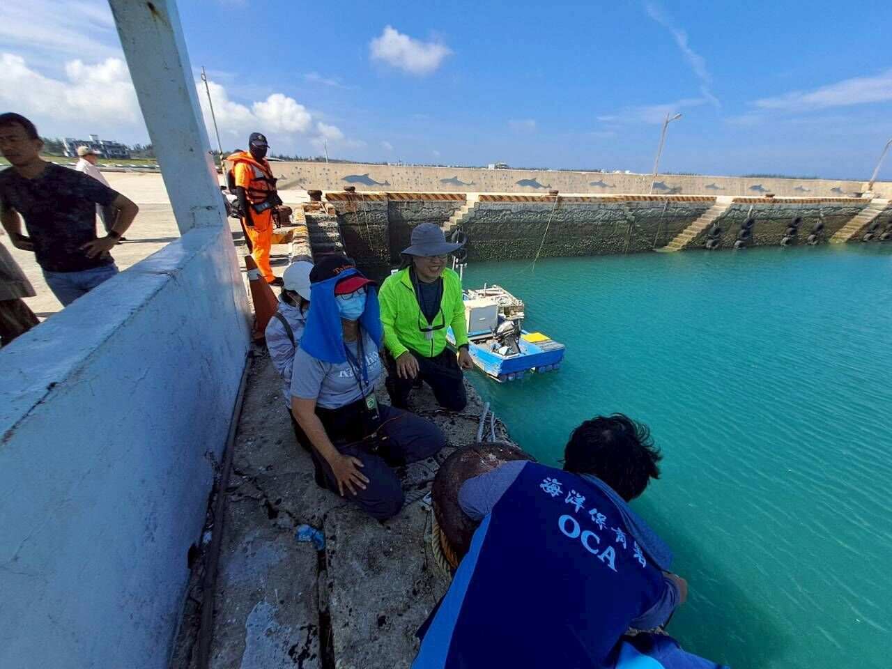
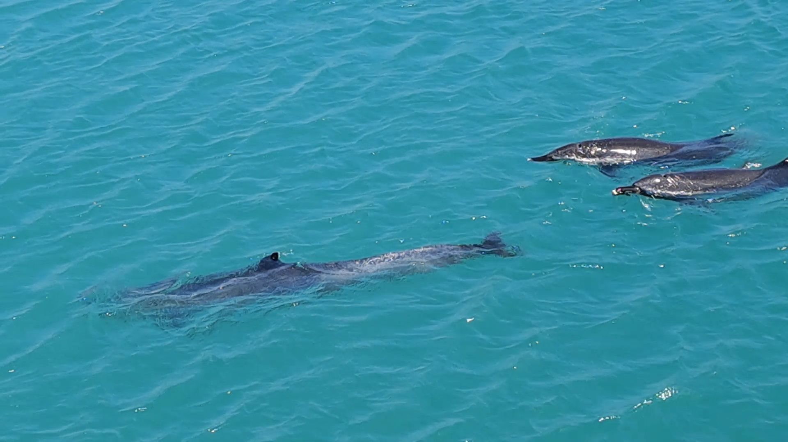

澎湖沙港西漁港近日出現3隻熱帶斑海豚，吸引在地鄉親與各界關注。經相關單位持續觀察與專家學者提供專業意見後，今日上午3隻海豚趁著大潮時機，已順利自行離開港區，回到更開闊的海域活動，讓所有關心牠們的民眾與保育夥伴都感到歡欣鼓舞。

熱帶斑海豚是行動敏捷、野性鮮明的海洋生物，年長個體身體斑點較多，常見白色吻端，成體體長約1.8至2.6公尺、體重約100至140公斤；其警覺性高、不易接近，在大洋中行動如風般迅速，也極少被圈養，保留了強烈奔放的野生習性。

值得一提的是，多年前沙港也曾有瓶鼻海豚出沒紀錄。瓶鼻海豚與本次出現的熱帶斑海豚在外觀與行為上有所不同，瓶鼻海豚多出現在近岸海域，體型通常也較大，嘴角常呈現上揚狀，給人較為親近、熟悉的印象；相較之下，熱帶斑海豚體型較為修長，年長個體身上斑點較明顯，警覺性也較高，較不容易接近。

海洋保育署表示，無論是瓶鼻海豚或這次短暫停留的熱帶斑海豚，牠們進入港區或近岸水域時，最重要的原則都是尊重野生動物的自主行為，降低不必要的人為干擾，並讓牠們保有判斷環境、尋找離港時機的空間。此次3隻熱帶斑海豚今早能夠自由自在地選擇離開，正是各界共同以「不打擾、持續觀察、必要時提供協助」為原則所促成的良好結果。

此次事件也要特別感謝中華鯨豚協會、國立自然科學博物館、國立成功大學海洋生物及鯨豚研究中心、國立臺灣大學獸醫專業學院及黑潮海洋文教基金會等單位專家學者，提供寶貴專業建議；同時也有多位保育夥伴親赴現場協助監測海豚活動與健康情形，並設法降低人為干擾，守護牠們能夠安全自主離開。

海洋保育署也感謝澎湖縣政府積極應處，及沙港民眾關心與協助，讓大家得以在安全、尊重且有秩序的情況下，擁有一次近距離觀察美麗海洋生物的珍貴機會，並進一步理解野生鯨豚的習性與保育意義。海洋保育署同時也呼籲，未來民眾若在港區、岸邊或海上發現鯨豚、海龜等大型海洋野生動物，應保持適當距離，減少聲響、船舶活動或近距離接觸所造成的干擾，並儘速通報相關單位，由專業團隊協助評估處置。每一次與野生動物的相遇，都是理解海洋、學習共存的重要契機；唯有以尊重取代干擾，才能讓海洋生物在牠們熟悉的藍色家園中，自由自在地生活。

圖1黑潮海洋文教基金會余欣怡博士與海保署巡查員施放水下錄音機監測海豚發聲狀

圖2澎湖沙港西漁港三隻熱帶斑海豚平安游離港區

權責機關及發言人：海洋保育署李筱霞副署長
聯絡電話：07-3382057#262021或0937-498-122
發稿單位及聯絡人：海洋生物保育組洪國堯組長
聯絡電話：0918-329-105
發稿日期：115年5月26日