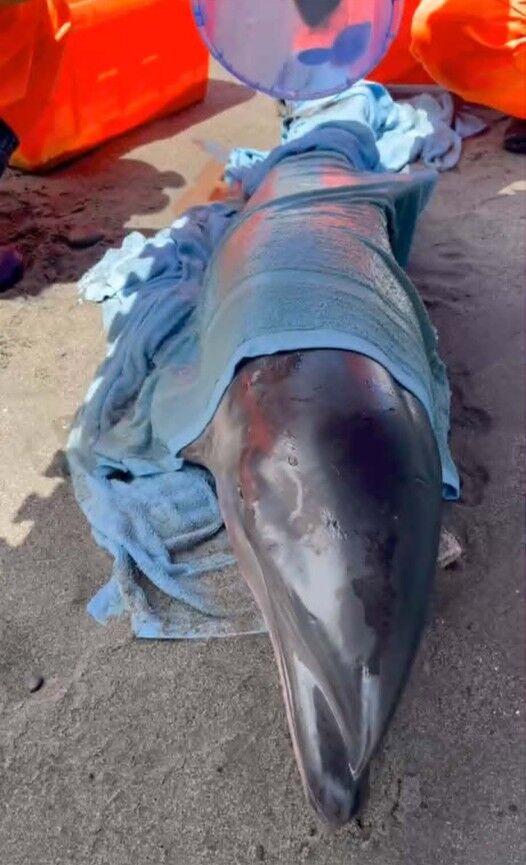
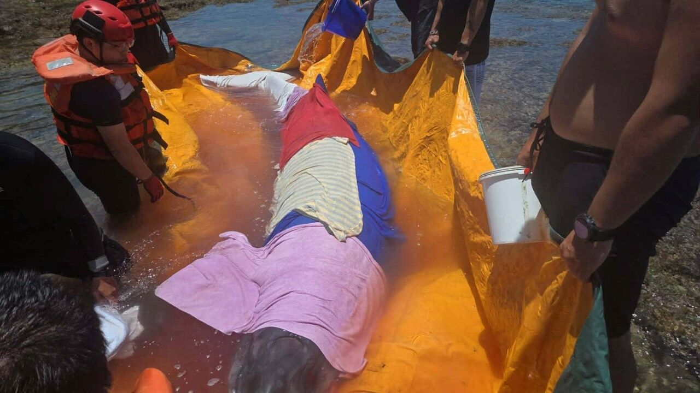

今（18）日上午在臺東縣綠島鄉石朗海域及大武鄉南田塔瓦溪出海口岸際分別出現2起活體鯨豚擱淺，海保署MARN機制遂即啟動，由海巡署第十巡防區第一三岸巡隊、海保署臺東海洋保育站、成功大學海洋生物及鯨豚研究中心王浩文主任救援團隊以及熱心民眾共同投入救援工作。

海保署表示，於綠島鄉石朗海域之擱淺鯨豚，經判斷為柏氏中喙鯨（學名：Mesoplodon densirostris），民眾通報該個體有不斷往岸上泳動的情形，經海巡署綠島安檢所同仁及當地潛水人員、小型動力漁船協助之下，已於下午1時30分左右順利將該個體帶離至該區鄰近海域完成野放；至大武鄉南田塔瓦溪岸際擱淺鯨豚，經判斷為弗氏海豚(學名：Lagenodelphis hosei)，體長約為150公分，該個體於獲報後第一時間即協助完成扶正、保濕及遮蔭等重要處置，但仍於準備野放的救援過程中死亡，死亡個體將運往成大鯨豚中心進行解剖作業以釐清死因。

海保署說明，柏氏中喙鯨類為罕見且稀有之個體，主要生活在大洋深處，臺灣過去僅有極少數擱淺紀錄，因為族群數量資料缺乏而無法估算IUCN瀕危等級列，目前被歸為DD(數據缺乏)等級。弗氏海豚主要活動於溫暖且深水(1000公尺以深)的大洋海域，臺灣東部因周遭海底地形陡降，故近岸也常可見，花東海域賞鯨船約有2-3成的目擊率。

海保署再次呼籲，若發現擱淺或需要救援的鯨豚或海龜，為了自身以及動物的安全，請勿在沒有專業指導下，任意對動物進行處置，應趕快撥打海巡「118」專線或通知所在縣市海洋保育主管單位，盡可能提供詳細發現地點、時間及敘述動物狀況，才能讓海保救援網(MARN) 專業團隊能在最短時間內前往救援。

權責機關及發言人：海洋保育署李筱霞副署長
聯絡電話：07-3382057#262021或0937-498122
發稿單位及聯絡人：海洋生物保育組洪國堯組長
聯絡電話：0918-329105
發稿日期：115年5月18日