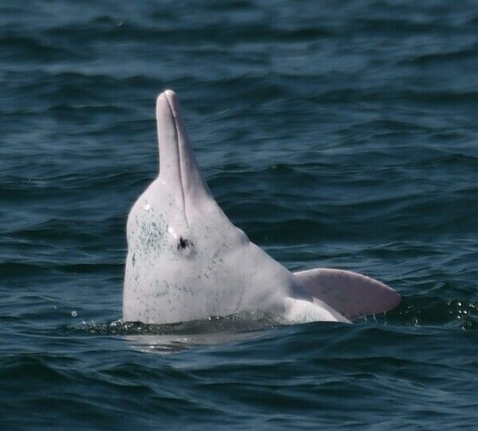
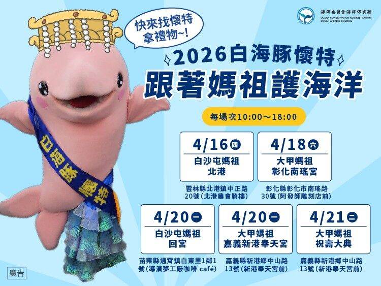
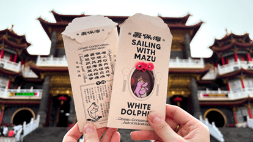
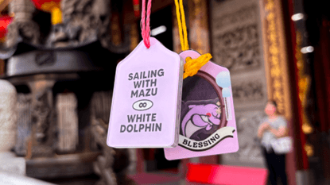
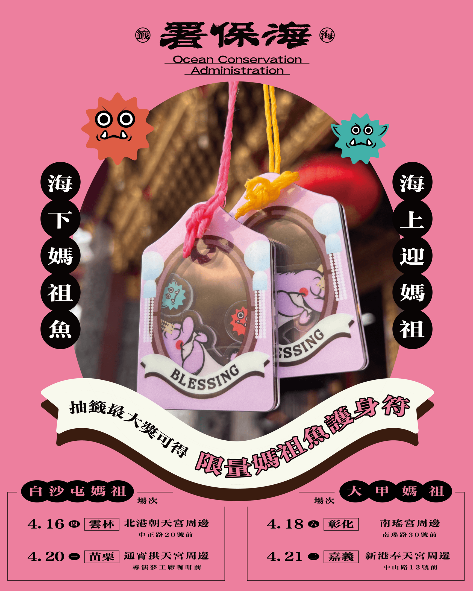

海洋保育署將與白沙屯媽祖進香及大甲媽祖遶境活動，分別於4月16日、18日、20日及21日設置海洋保育宣導攤位，帶著「媽祖魚」與信眾見面。現場規劃海洋保育知識介紹及互動小遊戲，民眾參與即可獲得精美小禮物；另外加入「珊海俱樂部LINE」官方帳號，參加「求海籤」活動，有機會獲得限量媽祖魚護身符，把來自海洋的祝福一起帶走。

每年農曆三月媽祖誕辰前後，臺灣西岸海象轉趨平穩，苗栗至臺南沿近海常可見白海豚出水換氣，漁民相傳白海豚是為向媽祖祝壽而來，便給了牠們稱號——媽祖魚。海保署指出近年來白海豚的棲息環境正面臨棲地開發與海洋污染等多重生存壓力，已被列為極度瀕危物種。為守護這群珍貴的海洋生命，海保署持續與地方漁會及相關組織合作，成立「白海豚巡護艦隊」，並積極推動漁民參與目擊通報機制，迄今已累積388筆回報資料，透過公民科學的方式建立長期監測數據，使第一線的海上工作者也成為守護海洋的重要夥伴。

配合此次媽祖繞境活動，海保署特別規劃「線上求海籤」活動，結合媽祖文化與白海豚保育意象，邀請民眾在參與信仰盛事的同時，也一起關心海洋保育。活動中若抽中「神兆」，即可兌換限量媽祖魚護身符。護身符的繩結特別採用回收再製而成，由海保署與海廢再生聯盟成員「迦南樂活全人發展協會」合作，採用廢棄漁網回收線材製成，將原本可能危害海洋生物的廢棄物，轉化為蘊含祝福意義的守護象徵，不僅別具巧思，也傳達資源循環利用與海洋友善的理念。

海保署署長陸曉筠表示，為響應年度媽祖盛事，今年特別規劃「線上求海籤」活動，將白海豚的出沒意象轉化為結合信仰語境的吉兆。除了線上祈福，更熱烈邀請民眾親臨活動現場攤位，近距離認識白海豚與海洋保育議題，透過互動參與讓守護「媽祖魚」的理念化為全民行動，邀請大家一同走進攤位，深度探索豐富的海洋世界。

活動資訊｜【海上拜媽祖，海下媽祖魚】抽海籤活動，攤位開放時間：10:00－18:00

【白沙屯媽祖攤位資訊】
4月16日（四）雲林北港朝天宮周邊（雲林縣北港鎮中正路20號前）
4月20日（一）苗栗通宵拱天宮周邊（苗栗縣通霄鎮導演夢工廠咖啡前）
【大甲媽祖攤位資訊】
4月18日（六）彰化南瑤宮周邊（彰化縣彰化市南瑤路30號前）
4月21日（二）嘉義新港奉天宮周邊（嘉義縣新港鄉中山路13號前）

【線上求海籤】
加入官方LINE即可抽籤，每帳號限抽一次：[https://lin.ee/ne8PJdH](https://lin.ee/ne8PJdH)

圖一、臺灣白海豚被稱為媽祖魚主要棲息於西部沿海淺海是我國極度瀕危的海洋保育類野生動物

圖二、海保署「跟著媽祖護海洋」活動攤位資訊，將於白沙屯媽祖進香及大甲媽祖遶境期間設置宣導攤位

圖三、護身符使用「蔗素紙」，這是 MIT 的回收紙材，原料為 100% 甘蔗纖維，減少砍伐原木，保留纖維原色。

圖四、媽祖魚護身符採用回收廢棄漁網再製繩結，將海洋廢棄物轉化為守護象徵。

圖五、海保署舉辦的「海上迎媽祖，海下媽祖魚」抽海籤活動，抽中神兆者，即可獲得限量媽祖魚護身符。

權責機關及發言人：海洋保育署李副署長筱霞
聯絡電話：07-3382057#262021或0937-498-122
發稿單位及聯絡人： 海洋生物保育組洪組長國堯
聯絡電話：0918-329-105
發稿日期：115年4月15日